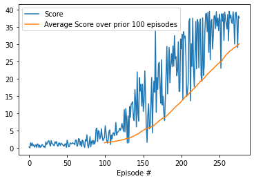

# Project 1: Continuous Control

## Learning Algorithm

For this project I trained a Deep Deterministic Policy Gradient (DDPG) agent for the Unity Reacher environment. The code for the agent and its models was based on Udacity's "[ddpd-pendulum" example](https://github.com/udacity/deep-reinforcement-learning/tree/master/ddpg-pendulum). 

This agent maintains actor and critic neural networks. The critic network approximates the action value function Q(s, a) and the actor network tries to select the action maximizing that function based on the current state. The agent also maintains target actor and critic networks to compute the next action and Q value to learn from. These networks are soft updated with a weight of TAU after each learning step. 

Both actor and critic networks have two hidden linear layers, with 400 and 300 units in the first and second layers respectively.  The actor network takes the 33 dimensional state and outputs a 4 dimensional action. It has ReLU activations on the first and second layers and a tanh activation on the output. The critic network likewise has ReLU activations on its hidden layers. It takes the state and action as input, passes the state to the first hidden layer, then concatenates that layer's output with the action as input to the second layer. It has no activate on its output.

The DDPG agent also uses experience replay and selects actions with the addition of normally distributed noise multiplied by a linearly decaying epsilon value. This differed from the Ornstein-Ulenbeck noise used in the [original DDPG paper](https://arxiv.org/abs/1509.02971) and the provided Udacity code, but seemed to result in much faster learning. Another alteration is that the agent only updates its networks after every 10 steps. I also tried using batch normalization, but this hurt performance. The best performance, solving the environment with a score of 30 after 177 episodes, was achieved using the following set of hyperparameters.

		BUFFER_SIZE = int(1e6)
		BATCH_SIZE = 64
		GAMMA = 0.99
		TAU = 1e-3
		LR_ACTOR = 1e-4
		LR_CRITIC = 1e-4
		WEIGHT_DECAY = 0
		UPDATE_EVERY = 10
		UPDATE_ITERATIONS = 1
		EPSILON_START = 1
		EPSILON_END = .1
		EPSILON_DECAY = 1e-6

## Ideas for Future Work

Hyperparameter tuning was not exhaustive, so it may be possible to improve performance with further tuning. I could also try other algorithms, such as Proximal Policy Optimization. 
